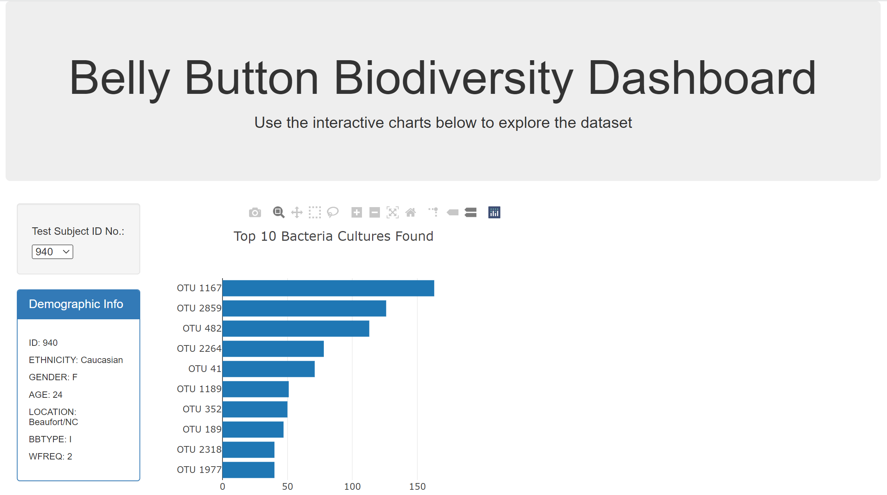
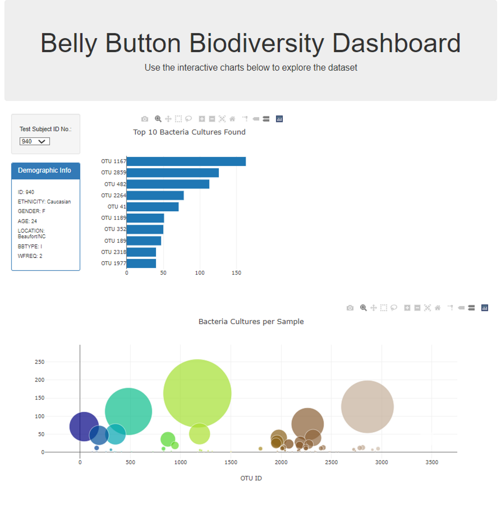
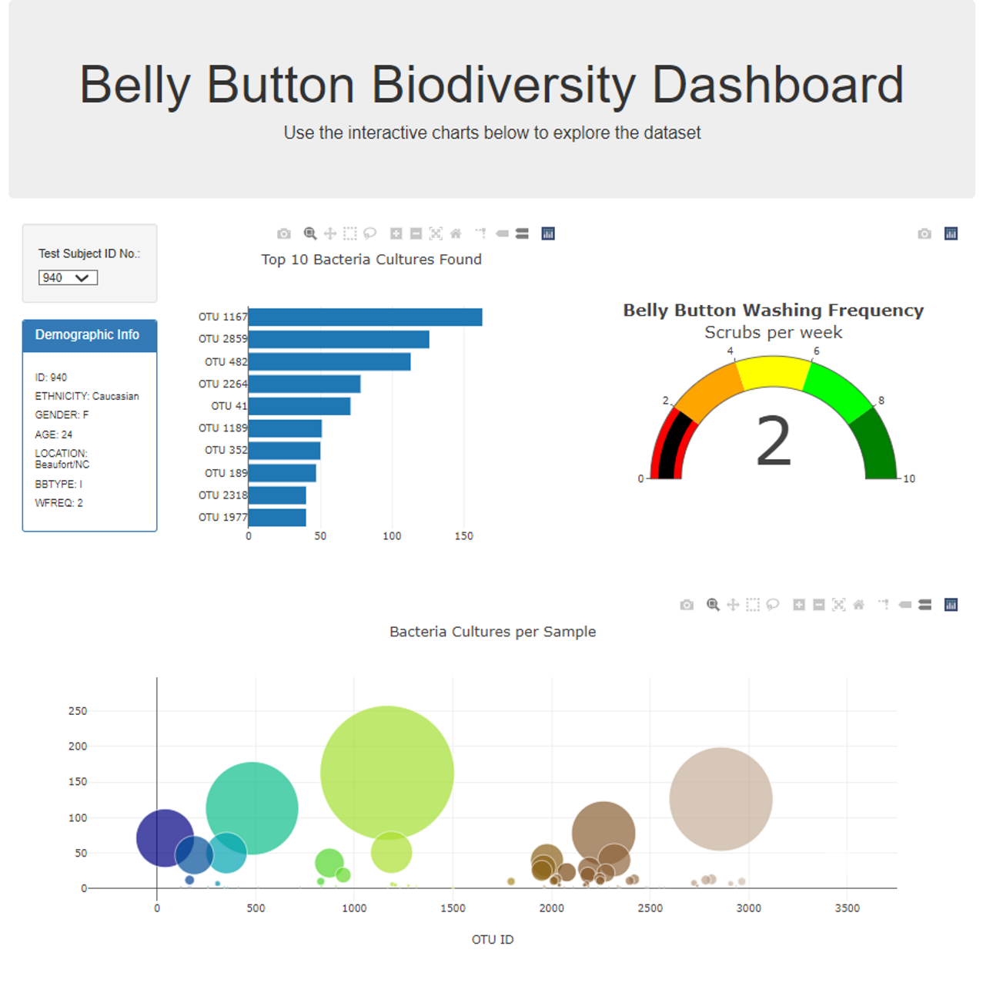
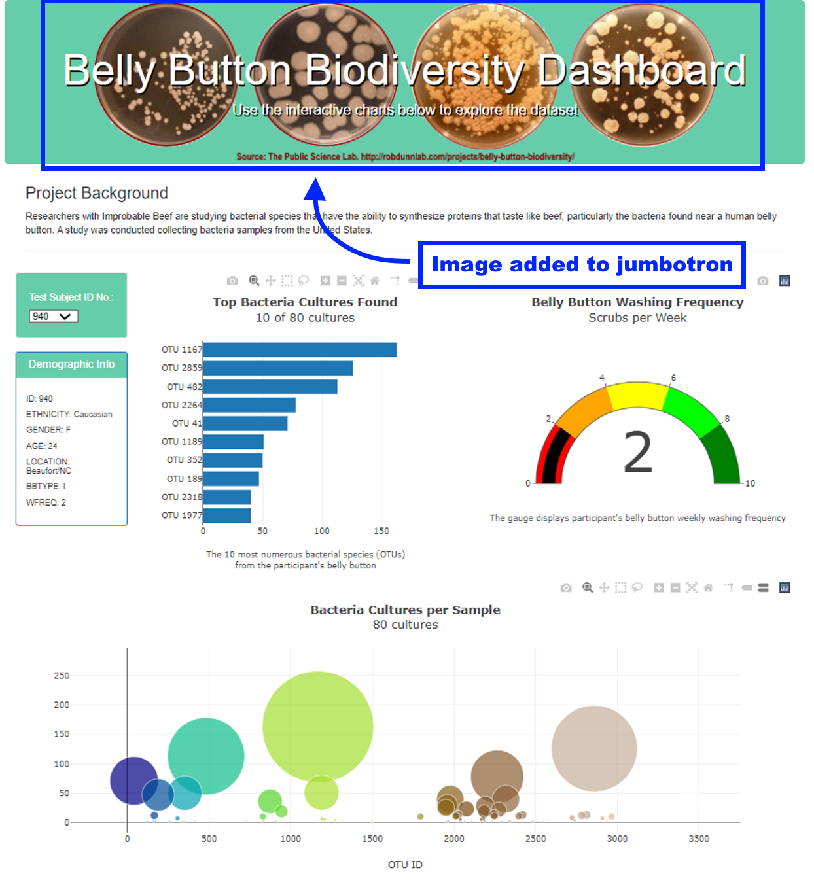
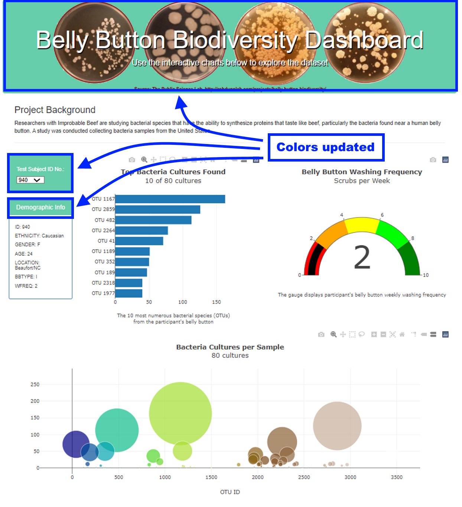
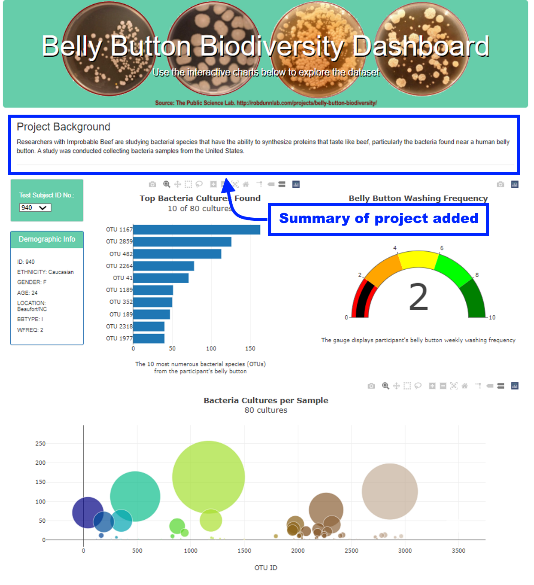
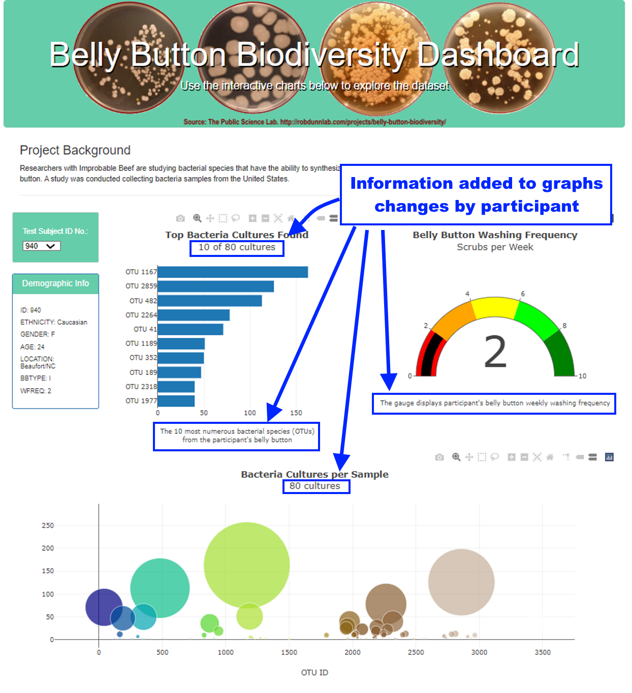
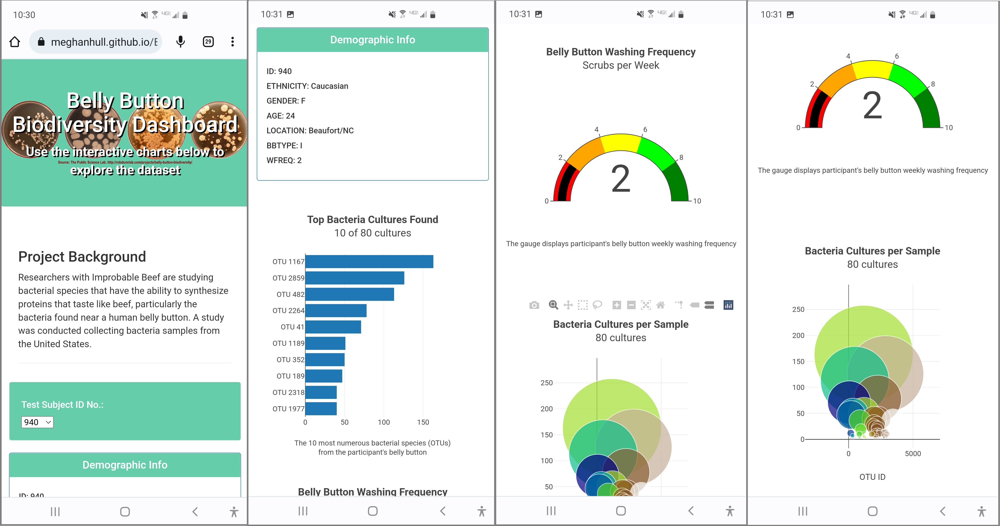

# Belly Button Bacteria Data
<!-- Dynamic dashboard for visualizing human belly button bacteria using ES6, Plotly, D3, HTML, CSS, &amp; Bootstrap (Rice Bootcamp) -->
## Project Background
Rosa and Improbable Beef are interested in bacterial species that have the ability to synthesize proteins that taste like beef.  Rosa theorizes the perfect bacteria is found near a human belly button.  Participants and researchers need to visualize the database of bacteria samples from the United States by participant ID.

## Purpose
Allow participants and researchers to visualize study data via a web-based dynamic dashboard, built using ES6, Plotly, D3, HTML, CSS, and Bootstrap.

## Resources
### Deployed Website
[https://meghanhull.github.io/Belly_Button/](https://meghanhull.github.io/Belly_Button/)

### Data Sources & Customized Files
1. [samples.json](js/samples.json)
2. [charts.js](js/charts.js)
3. [style.css](css/style.css)

### Software
***Table 1: Software Versions***
| Software | Version |
| :--- | :---: |
| JavaScript | ES6+ |
| BootStrap CSS | 3.3.7 |
| D3 CDN | 4.11.0 |
| Plotly CDN |  |
| Visual Studio Code | 1.69.2 |

# Deliverables
## Deliverable 1: Create a Horizontal Bar Chart
The first deliverable was to create a horizontal bar chart to display the top 10 bacterial species (OTUs) when an individual’s ID is selected from the dropdown menu on the webpage.  The horizontal bar chart displays the *sample_values* as the values, the *otu_ids* as the labels, and the *otu_labels* as the hover text for the bars on the chart.

View Screenshot of Deliverable 1

  

  
  

## Deliverable 2: Create a Bubble Chart
The second deliverable was to create a bubble chart that displays the following when an individual’s ID is selected from the dropdown menu webpage:
- The *otu_ids* as the x-axis values.
- The *sample_values* as the y-axis values.
- The *sample_values* as the marker size.
- The *otu_ids* as the marker colors.
- The *otu_labels* as the hover-text values.

View Screenshot of Deliverable 2

  

  
  

## Deliverable 3: Create a Gauge Chart
The third deliverable was to create a gauge chart that displays the weekly washing frequency's value, and display the value as a measure from 0-10 on the progress bar in the gauge chart when an individual ID is selected from the dropdown menu.

View Screenshot of Deliverable 3

  

  
  

## Deliverable 4: Customize the Dashboard
The fourth deliverable was to the webpage for the dashboard.  The customizations implemented were:
1. Add an image to the jumbotron.
2. Add background color or a variety of compatible colors to the webpage.
3. Add more information about the project as a paragraph on the page.
4. Add information about what each graph visualizes, either under or next to each graph.
5. Make the webpage mobile-responsive.

View Customization #1 - Jumbotron Image

  

  
  

View Customization #2 - Updated Colors

  

  
  

View Customization #3 - Project Summary

  

  
  

View Customization #4 - Chart Info

  

  
  

View Customization #5 - Mobile Version

  

  
  

